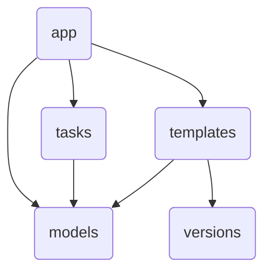

# video-index

This is a web-based application to keep track of video files on your local disk.

## Module dependencies

```mermaid
graph TD
    a(app)
    m(models)
    ta(tasks)
    te(templates)
    v(versions)

    a  --> m
    a  --> ta
    a  --> te
    ta --> m
    te --> m
    te --> v
```
